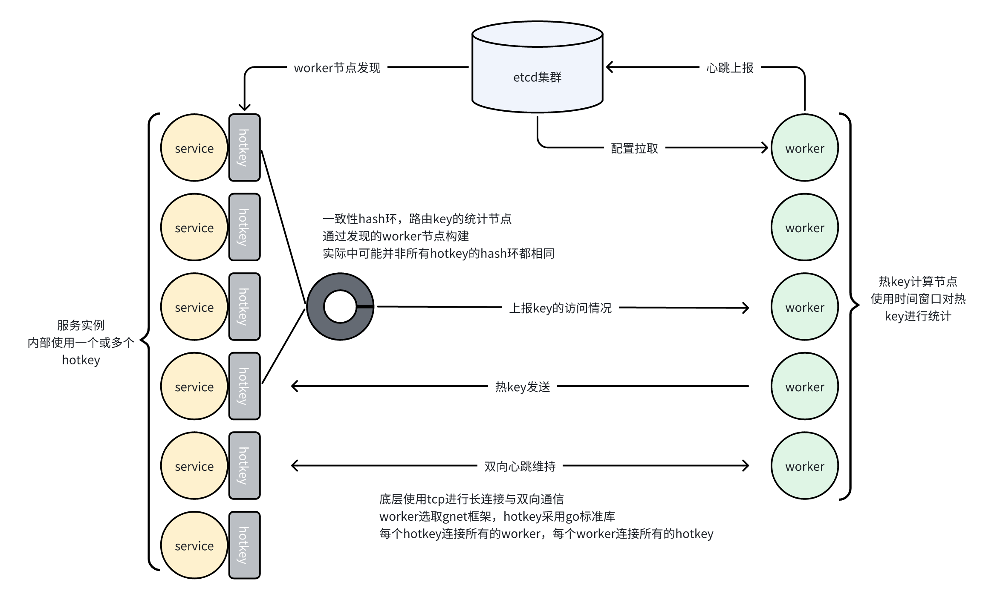
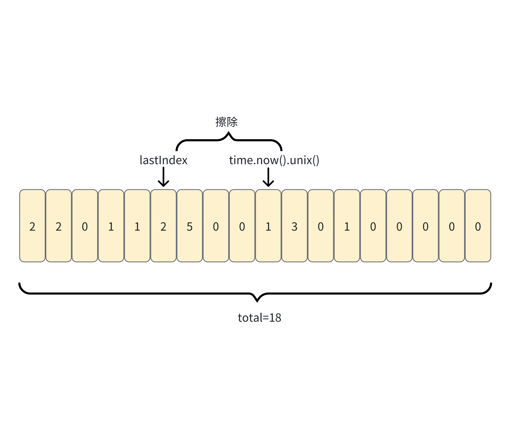

# hotkey-go：go语言实现的热点发现中间件，更轻松解决热key问题  

## 简介

这是一个热key发现中间件，快速发现热点，发现后，加入本地缓存或者限流，由使用者决定，降低热点对下游服务造成的冲击。  

该中间件分为两部分，go包hotkey，计算节点worker，worker节点可以水平扩展，hotkey将key的访问数据发送至worker进行计算，若成为热key则通知hotkey
## 快速开始

### 启动worker节点

更改worker目录下worker.go的配置
```go
func main() {
    // etcd地址，本机ip+port，port与下面的port保持一致
	err := service.RegisterService([]string{"1jian10.cn:4379"}, "1jian10.cn:23030", "worker/"+strconv.FormatInt(time.Now().UnixNano(), 10))

	if err != nil {
		panic(err.Error())
	}
    // 将端口号设置为
	err = server.Serve("tcp://0.0.0.0:23030")
	if err != nil {
		panic(err.Error())
	}
}
```
一键启动
```shell
go run worker.go #执行go run一键启动
```

### 使用hotkey

在etcd中添加配置，key为group/{groupName}，value为yaml格式的配置，效果如图
  
连接etcd，传入etcd的client以及groupName，groupName需要与在etcd中添加的groupName相同  
```go
	client, err := etcd.New(etcd.Config{
		Endpoints:   []string{"1jian10.cn:4379"},
	})
    core, err := hotkey.NewCore("test", client)
    value,ok:=core.Get("key")
    if core.IsHotKey("key"){
        // ...
    }
```

## 使用详解

### 初始化

#### 初始化接口  

groupName：同一group下值相等的key视为同一个key，会一起统计，一个group即是一个分组  
client：etcd的client
options：初始化选项，传入hotkey中提供的with...以更新默认配置
```go
func NewCore(GroupName string, client *etcd.Client, options ...Option) (*Core, error) {
}
```

#### 初始化选项
更改core中的本地缓存的大小，size表示byte，默认值为4GB
```go
func WithCacheSize(size int) Option {}
```
更改core中热key缓存的大小，size表示byte，默认值为128MB
```go
func WithKeySize(size int)Option{}
```
更改一致性hash中worker节点映射的虚拟节点的数量，相同group请使用相同的值，否则热key统计将会不准确，默认值为50
```go
func WithVirtualNums(nums int) Option {}
```
更改core发送channel的大小，默认值为1024*512
```go
func WithChannelSize(size int) Option {}
```
更改core发送key的间隔，默认值为100ms，过小影响性能，过大影响实时性
```go
func WithSendInterval(interval time.Duration) Option {}
```
将观察者加入观察者队列
```go
func WithObserver(observers ...Observer) Option {}
```
设置热key缓存时间，默认值为30s
```go
func WithTTL(ttl int) Option {}
```

### core
从本地缓存中获取value
```go
func (c *Core) Get(key string) ([]byte, bool) {}
```
将kv加入本地缓存
```go
func (c *Core) Set(key string, value []byte, ttl int) bool {}
```
从本地缓存中删除kv
```go
func (c *Core) Del(key string) bool {}
```
判断一个key是否是热key，即判断本地热key缓存中是否有这个key
```go
func (c *Core) IsHotKey(key string) bool {}
```

### 观察者
通过WithObserver将观察者加入观察者列表，在将热key加入本地热key缓存前将会轮询调用这些通知这些观察者  
可以看到，观察者为一个interface，只要实现do接口即为观察者，若该任务耗时不可忽略，请将key发送到channel异步处理，避免阻塞  
```go
type Observer interface {
	Do(key string)
}
```

### worker配置
```yaml
Group:
  #group名称
  Name: test
Window:
  # 窗口个数，每个窗口100ms
  Size: 20
  # 成为热key后多久才可以再次判断为热key
  TimeWait: 60  #second
  # 窗口总访问次数阈值，达到该阈值即判断为热key
  Threshold: 10 
  # 超时时间，一个key超过该时长没有访问则清理掉，避免内存泄露
  Timeout: 120  #second
```


## 概览

### 架构图


### 注册中心
首先，worker需要具有水平扩展的能力，而我们的hotkey需要感知到worker节点的变更，很明显，这里需要引入注册中心来实现  
这里选取的是etcd，etcd本身并不提供注册中心的api，一般自己实现服务注册与发现  
worker作为服务提供方将ip+port注册到etcd中，上报心跳维持etcd中的服务信息  
hotkey在启动时先获取所有worker节点信息，在通过watch worker/ ，来获取worker节点的变更信息  
服务注册与发现细节不做解释，随便一搜就有很多结果

### 配置中心与热更新
在进行热key的统计时，需要对配置进行实时的更新以应对不同的场景，将配置写在各个节点，一个个更改节点的配置信息显然是不可接受的，这里就需要引入配置中心来进行统一的配置调控  
由于已经选取了etcd作为注册中心，为了不引入其他组件，这里依旧使用etcd作为配置中心，配置中心依旧自己实现  
同时，配置更新作用于所有worker节点，重启节点是不可接受的，若热更新配置，需要解决并发问题  
worker节点启动时拉取所有配置，之后watch group/，获取配置变更信息并进行热更新  
热更新实现细节在下文进行详解

### 长连接
worker与hotkey需要进行双向通信，也即全双工的通信协议，这里选取tcp作为底层通信协议  
worker作为被动连接方，也即是server，选取gnet作为tcp框架  
由于在windows上开发，gnet对window的client支持不完善，这里采取go标准库的net来实现client  

### 路由
当发送key到worker时，需要选取发送到的worker节点，而且尽量保证相同的key在不同的hotkey实例中路由到相同的worker节点  
worker的热key统计基于单机，若分散在多台机器上，则key的统计将会及不精确，同时对worker节点的内存也会造成较大的压力    
这里采取一致性hash的路由方式，相较于hash路由的方式，在worker节点变动时，能大幅降低key的迁移数量  
由于各实例网络情况的差异，不能保证每个hotkey与worker的连接都相同，使用一致性hash也能保证路由结果相似  

### 批量发送
io操作比较耗时，若每次访问key立即发送key到worker节点，则会对机器造成较大的负载  
这里采取批量发送的方式，在内存中聚合消息，每隔一段时间发送一条聚合消息  
假设一个读接口，qps为1w，若不聚合，每秒io数最少为1w，采取每100ms发送一次的聚合策略，io数直接降低到常数级别  能够大幅降低负载  

## 实现细节
### hotkey初始化
这是hotkey的初始化api，传入groupName，etcd连接，在加上选项option  
```go
func NewCore(GroupName string, client *etcd.Client, options ...Option) (*Core, error) {
  // ...
  	for _, option := range options {
		option.Update(c)
	}
  //...
}
```
初始化最后的可变参数表示初始化选项，他将默认参数修改为传入参数  
这是go中常用的模式：函数选项模式，与设计模式中的builder模式相似，但在go中通常使用前者，是较为优雅的实现 
这种模式使用以下，首先声明一个option的interface，他包含一个方法，表示更新core的配置  
将optionFunc声明为func(core*Core)的别名，并实现option中的方法，实现方式为调用自身  
这时声明一个返回option的函数，内部通过闭包捕获传入的参数，之后我们在初始化时调用该option即可更新默认值
```go
type Option interface {
	Update(core *Core)
}

type OptionFunc func(core *Core)

func (op OptionFunc) Update(core *Core) {
	op(core)
}

func WithCacheSize(size int) Option {
	return OptionFunc(func(core *Core) {
		core.cache = freecache.NewCache(size)
	})
}
```
### hotkey观察者
在初始化有一个特殊的初始化选项，他并不改变core的配置，而是将观察者注册到core中
```go
func WithObserver(observers ...Observer) Option {}
```
观察者即为实现了以下interface的类  
将观察者注册到core中后，当接收到worker节点的消息，热key加入cache前，将会调用所有的observer的do方法  
为了避免阻塞，建议将do实现为发送到channel中异步处理(未来将会实现消息总线，从而do方法可以直接调用)  
如此实现，可将kv加入cache的工作交给observer实现，而无需在cache层面采取旁路缓存的模式，降低业务处理的复杂度
```go
type Observer interface {
	Do(key string)
}
```
这是一个典型的观察者模式实现  
初始化时将观察者注册到subject中，事件发生时通知所有的observer  
```go
type Subject interface {
	register(ob Observer)
	notify(key string)
}
```

### tcp报文处理
worker与hotkey需要进行双向通信，这里采用tcp进行实现，在报文处理时，对于不同种类的报文将会有不同的处理  
一般的实现为if else判断类型，之后调用各种处理办法
```go
if msg.Type=="1"{
  //...
}else if msg.Type=="2"{
  //...
}else if msg.Type=="3"{
  //...
}//...
```
这里采取工厂+策略模式来消除if else  
优化后的实现如下,可以看出，这种实现降低了业务的耦合度，同时可读性也有所上升
```go
s := GetMsgStrategy(msg.Type)
s.Handle(msg)
```
声明如下，首先声明msg处理策略的interface，实现其内部方法handle即为一种处理策略  
接着有一个全局的map，type与strategy一一对应  
调用get方法来获取msg.Type对应的处理策略  
调用register来将strategy注册到map中  
实现流程:  

1. 实现handle
2. 在init中调用register将策略注册到map中
3. 接收tcp报文，调用get获取策略
4. 调用策略的handle方法

```go
type MsgStrategy interface {
	Handle(msg *model.ServerMessage)
}

var (
	msgStrategies map[string]MsgStrategy
)

func GetMsgStrategy(msgType string) MsgStrategy {
	return msgStrategies[msgType]
}

func MsgRegister(msgType string, strategy MsgStrategy) {
	msgStrategies[msgType] = strategy
}
```
### 热点统计-滑动窗口
这是热点统计的核心，对于每个key，我们维持最近一段时间的访问次数，当达到一定次数，即视为热key  
滑动窗口如图所示  每方块为一个窗口，数字代表该窗口内访问次数

定义如下
```go
type Window struct {
	config *config.WindowConfig //  滑动窗口配置文件
	mutex  sync.Mutex // mutex,保证并发安全
	lastTime int64 //上次访问该key的时间戳
	lastIndex int64 // 上次访问该key的时间窗口
	lastSend int64 // 上次发送的时间戳
	window []int64 // 窗口数组
	total int64 // 窗口内访问总数
}
```
每次发送热key至hotkey，设置lastSend，若当前时间距上次发送间隔较短，则不统计  
每次访问key设置lastTime，若当前时间距上次访问间隔超过窗口表示的总时间，则重置窗口(全部置为0),并将window[0]设置为访问次数  
lastIndex表示上次统计结束时，时间窗口的索引，每次将lastTime+100ms，直到当前时间戳和lastTime落在一个时间窗口内，同时将lastIndex向前移动，移动中的窗口全部置为0  
具体实现如下所示  
```go
func (w *Window) Add(times int64) bool {
	w.mutex.Lock()
	defer w.mutex.Unlock()
	t := time.Now().UnixMilli()
	if t-w.lastSend <= w.config.TimeWait*1000 {
		return false
	}
	if t-w.lastTime > w.config.Size*100 {
		for i := 0; i < len(w.window); i++ {
			w.window[i] = 0
		}
		w.window[0] = times
		w.total = times
		return times >= w.config.Threshold
	}

	for t/100 != w.lastTime/100 {
		w.lastTime += 100
		next := (w.lastIndex + 1) % (int64(len(w.window)))
		w.total -= w.window[next]
		w.window[next] = 0
		w.lastIndex = next
	}
	w.total += times
	w.window[w.lastIndex] += times
	return w.total >= w.config.Threshold
}
```
### 配置热更新  
若每次配置变更，都需要将所有连接断开，或者重启worker节点使配置生效，这几乎是可不可接受的，所以我们的worker节点需要动态对配置进行更新，最大可能不影响节点的可用性  
首先，全局维护一个groupMap，存储所有group，每个配置文件对应一个group  
cmap为该包[concurrent-map](https://github.com/orcaman/concurrent-map)，简单来说是一个使用分片锁来保证并发安全的map  
当添加或更新配置文件时，不管map中有无该group，直接进行新建一个group并进行覆盖    
当删除配置文件时，直接在该map中删除该group  
```go
cmap.ConcurrentMap[string, *group]
```
group如下，config即为配置文件，创建一个group时，必须传入config   
```go
type group struct {
	config        *config.Config
	keys          cmap.ConcurrentMap[string, *window.Window]
	//...
}
```
这是去除长度声明的tcp报文，主要关注后两项，每个消息必须包含groupName  
worker接收到hotkey的消息时，首先在全局的groupMap中寻找有无groupName对应的group  
若无，则认为是非法连接，直接断开，否则进行下一步处理  
当处理key消息时，获取group，在该group中的keys中寻找该key是否存在，若不存在，则通过该group的配置文件新建(这两步保证原子性)  
可以看出，多个相同的key，配置文件可能不同，但保证，处理1个key的过程中，该配置文件不会变化  
```go
type ClientMessage struct {
	Type      string         `json:"type"`
	GroupName string         `json:"group_name"`
	Key       map[string]int `json:"key"`
}
```
## 实现参考
[京东零售/hotkey](https://gitee.com/jd-platform-opensource/hotkey)  
[热点检测治理](https://www.bilibili.com/opus/747922203512668199)    
[hotcaffeine](https://github.com/sohutv/hotcaffeine)  
[camellia](https://github.com/netease-im/camellia)


